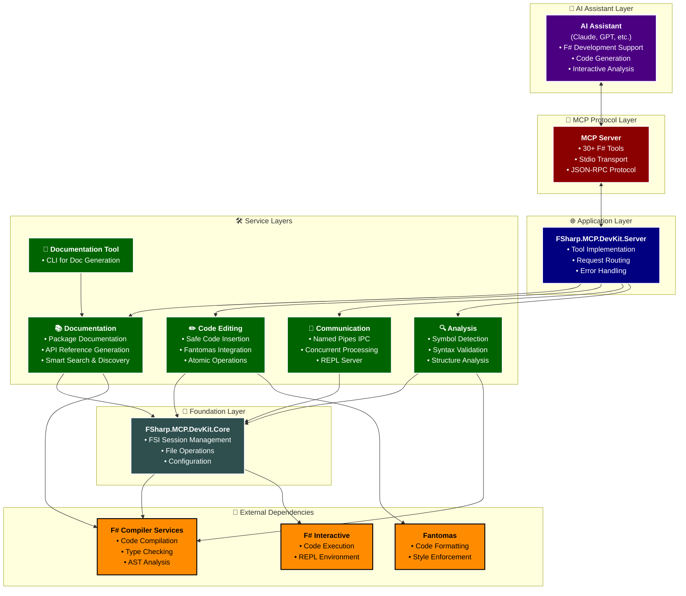

# FSharp.MCP.DevKit 🚀

[](https://dotnet.microsoft.com/)
[](https://fsharp.org/)
[](https://modelcontextprotocol.io/)
[](LICENSE)

A prototype of an F# development toolkit delivered via the **Model Context Protocol (MCP)**. It provides F# Interactive (FSI) capabilities, code documentation, safe code manipulation, and analysis tools with language server features. Integration with the FAKE build system is under development.

## ⚠️ Disclaimer (by EHotwagner)

This project has been developed with significant reliance on AI-driven tools. While it has proven to be surprisingly effective—largely by leveraging robust libraries like **F# Compiler Services** and **Fantomas**—it will contain inaccuracies or incomplete features. Especially regarding Documentation, the agent tends to insert tons of industry buzzword BS whenever you look away for a second. 

### Please Note:
- **Code Verification**: The entire codebase and its documentation have not been manually verified for correctness or completeness. However, the core features described should be functional (as in I have seen them work at least once).
- **Agent Stability**: The AI agent's instructions are generally initially effective, but after it deviates, restarting the agent to reset its context is recommended.
- **DevEnvironment**: This project has been developed in VSCode with GH Copilot, mostly using Claude Sonnet 4 and a bit of Gemini 2.5 Pro for planning and design.
- **Design**: Documentation is written somewhat with REPL-driven development in mind, allowing for interactive code generation and testing. I am currently tending towards a more script-driven development approach, which allows for structured experimentation and reproducible testing. REPL works with hosted FSI sessions, which in this context are not easy to configure, a bit fragile with some Input, have no nice output (only MCP-Tools output terminal and agent chat window). Letting the agent start a standard fsi process in an agent observed terminal is ofcourse possible but cumbersome in VSCode since terminal actions need approval. This project should be neutral to the chosen approach in the future. VsCode Insiders has https://github.com/microsoft/vscode/issues/253103 which changes the ergonomics a lot. Needs considerations. 
- **Get Started**: There are no releases yet. For VSCode use this https://devblogs.microsoft.com/dotnet/build-a-model-context-protocol-mcp-server-in-csharp/ approach. Add the project to the mcp.json file. Later a dotnet tool might be the best way to distribute this project. 

## ✨ Key Features

### 🔧 F# Interactive Integration
- **Persistent FSI Session**: Stateful F# Interactive session management
- **Code Execution**: Execute F# code with comprehensive error handling and validation
- **Script Loading**: Load and manage F# script files with dependency tracking
- **Package Management**: Reference .NET assemblies and NuGet packages seamlessly
- **Expression Evaluation**: Evaluate F# expressions with full type information

### 📚 Documentation Generation & Search
- **📦 Package Documentation**: Generate comprehensive API docs for NuGet packages
- **🔍 Smart Search**: Search through generated documentation with context-aware results
- **📖 API Reference**: Create structured markdown documentation for modules and types
- **🏗️ Project Documentation**: Bulk documentation generation for entire F# projects
- **💾 Package Discovery**: Browse and explore available NuGet packages in local cache
- **⚙️ Configuration Management**: Runtime configuration of documentation settings

### ✏️ Safe Code Manipulation
- **🛡️ Safe Code Insertion**: Insert F# code with AST validation and type checking
- **🎨 Code Formatting**: Deep integration with Fantomas for consistent code formatting
- **🔍 Structure Analysis**: Analyze F# code structure, dependencies, and syntax
- **👀 Preview Capabilities**: Preview code changes before applying them
- **⚡ Atomic Operations**: Atomic file operations with backup/rollback support

### 🧠 Advanced Analysis Tools
- **🔍 Symbol Detection**: Advanced symbol detection and resolution
- **📊 Syntax Validation**: Comprehensive F# syntax analysis and error reporting
- **🗂️ Dependency Analysis**: Track and analyze code dependencies and relationships
- **🎯 Position-Sensitive Analysis**: Context-aware code analysis based on cursor position

## 🏗️ Architecture

The FSharp.MCP.DevKit follows a **modular, layered architecture** with clear separation of concerns:

```
├── 🔧 FSharp.MCP.DevKit.Core/          # Foundation layer
│   ├── FSI session management & execution
│   ├── File system utilities & helpers  
│   └── Core types & configurations
│
├── 🔍 FSharp.MCP.DevKit.Analysis/      # Code intelligence layer
│   ├── F# syntax validation & analysis
│   ├── Symbol detection & resolution
│   └── Code structure analysis
│
├── 📡 FSharp.MCP.DevKit.Communication/ # IPC infrastructure
│   ├── High-performance named pipes
│   └── Persistent REPL server
│
├── ✏️ FSharp.MCP.DevKit.CodeEditing/   # Code manipulation layer
│   ├── Safe code insertion & editing
│   ├── Fantomas formatting integration
│   └── Atomic file operations
│
├── 📚 FSharp.MCP.DevKit.Documentation/ # Documentation generation
│   ├── .NET assembly analysis
│   ├── NuGet package documentation
│   └── Markdown API reference generation
│
└── 🌐 FSharp.MCP.DevKit.Server/        # MCP server & tools
    ├── MCP protocol implementation
    ├── 30+ specialized F# tools
    └── Server runtime & hosting
```

### 🔄 Data Flow Architecture



## 🛠️ MCP Tools Overview

The server provides **30+ specialized MCP tools** organized into categories:

### 📚 Documentation Tools (New!)
- `GeneratePackageDocumentation` - Generate comprehensive API docs for NuGet packages
- `GenerateProjectDocumentation` - Bulk documentation for entire F# projects  
- `SearchDocumentation` - Search through generated documentation with context
- `ListCachedPackages` - Browse available NuGet packages in local cache
- `ShowPackageInfo` - Get detailed information about specific packages
- `SetDocumentationOutputDirectory` - Configure documentation output settings
- `ShowDocumentationConfig` - Display current documentation configuration

### 🔧 FSI Management
- `CheckFSIServerStatus` - Check FSI server status and availability
- `ResetFSISession` - Reset the FSI session clearing all state
- `RestartFSISession` - Restart FSI session (stop and start fresh)
- `GetFSIState` - Get current FSI state and bindings

### ⚡ Code Execution
- `ExecuteFSharpCode` - Execute F# code with comprehensive error handling
- `ExecuteFSharpCodeDetailed` - Execute with detailed error information
- `EvaluateFSharpExpression` - Evaluate expressions with type information
- `LoadFSharpScript` - Load F# script files with dependency tracking
- `ReferenceAssembly` - Reference .NET assemblies
- `ReferenceNuGetPackage` - Reference NuGet packages dynamically
- `AddSearchPath` - Add directories to F# search path

### ✏️ Code Manipulation & File Operations
- `InsertCode` - Unified code insertion with validation and formatting
- `PreviewCodeInjection` - Preview code changes before applying
- `FormatFile` - Format entire F# files using Fantomas
- `DeleteLines` - Delete specific lines from files
- `ReplaceTextRange` - Replace text in specific line ranges
- `SearchAndReplace` - Search and replace with pattern matching
- `MoveCodeBlock` - Move code blocks between locations
- `GetLines` - Extract specific lines for inspection
- `CountLines` - Count lines and characters in files
- `SearchInFile` - Search for patterns with line numbers

### 🔍 Analysis & Structure
- `AnalyzeCodeStructure` - Analyze F# code structure and dependencies
- `ParseAndCheckFSharpCode` - Parse and validate F# syntax and types
- `ParseSourceToAST` - Parse code to Abstract Syntax Tree

### 🛠️ Utility & Management
- `KillAll` - Kill all MCP server processes for clean restarts (temporary till FAKE integration)

## 🚀 Usage Examples

### Documentation Generation
```bash
# Generate documentation for a NuGet package
GeneratePackageDocumentation "System.Text.Json" "./docs" true

# Search through generated documentation  
SearchDocumentation "./docs" "JsonSerializer"

# List available packages
ListCachedPackages "System"
```

### Code Execution
```fsharp
// Execute F# code
ExecuteFSharpCode "let x = 1 + 2; printfn \"Result: %d\" x"

// Evaluate expressions with type info
EvaluateFSharpExpression "List.map ((*) 2) [1..5]"

// Reference packages
ReferenceNuGetPackage "FSharp.Data"
```

### Safe Code Insertion
```fsharp
// Insert code with validation and formatting
InsertCode "let newFunction x = x * 2" "MyScript.fsx" 10 1 true true

// Preview changes first
PreviewCodeInjection "let helper = ..." "MyScript.fsx" 15
```

## 🤖 Agent Development Strategies

This project provides **comprehensive strategies** for AI agents to work effectively with F# development through different methodologies:

### 📋 Available Development Approaches

The toolkit supports multiple development philosophies, each optimized for different scenarios and agent capabilities:

#### 🎯 [Script-Driven Development](docs/Agent-Instructions-Strategies/Script-Driven-Default/)
**Recommended for: Production workflows, complex validation, agent-driven development**
- **[📖 Design Philosophy](docs/Agent-Instructions-Strategies/Script-Driven-Default/Design.md)** - Comprehensive guide to script-based development methodology
- **[🛠️ Copilot Instructions](docs/Agent-Instructions-Strategies/Script-Driven-Default/copilot-instructions.md)** - Detailed agent instructions for script-driven workflows
- **Key Characteristics**: Reproducible execution, structured output, comprehensive validation, audit trails

#### 🔄 [REPL-Driven Development](docs/Agent-Instructions-Strategies/REPL-Driven-Default/)
**Recommended for: Exploration, prototyping, interactive development**
- **[📖 Design Philosophy](docs/Agent-Instructions-Strategies/REPL-Driven-Default/Design.md)** - Deep dive into REPL-based development patterns
- **[🛠️ Copilot Instructions](docs/Agent-Instructions-Strategies/REPL-Driven-Default/copilot-instructions.md)** - Agent guidance for interactive REPL workflows
- **Key Characteristics**: Immediate feedback, live debugging, exploratory programming, state preservation

## 📖 Documentation

### 📂 Project Documentation
Comprehensive documentation organized by project:

- **[📚 All Projects Documentation](docs/projects/)** - Complete documentation index
- **[🔧 Core](docs/projects/Core/)** - Foundation layer documentation
- **[🔍 Analysis](docs/projects/Analysis/)** - Code analysis and intelligence
- **[📡 Communication](docs/projects/Communication/)** - IPC infrastructure
- **[✏️ CodeEditing](docs/projects/CodeEditing/)** - Code manipulation capabilities
- **[🌐 Server](docs/projects/Server/)** - MCP server implementation
- **[📚 Documentation](docs/projects/Documentation/)** - Documentation generation

### 📋 General Documentation
- **[🏗️ Architecture](docs/Architecture.md)** - System design and architecture
- **[✨ Features](docs/Features.md)** - Detailed feature documentation
- **[🎯 Terminal Code Execution](docs/Terminal-Code-Execution.md)** - Multi-terminal F# execution and session targeting
- **[📝 Design & Analysis](docs/DESIGN_AND_ANALYSIS.md)** - Design decisions and analysis
- **[📋 Implementation Summary](docs/Implementation-Summary.md)** - Implementation details
- **[🗂️ Plans & Specifications](docs/plans/)** - Development roadmaps


## �️ Development Roadmap

### 🎯 Near-term Enhancements 
**🔄 Currently In Progress:**
- 📚 **Cross-reference linking** - Automatic linking between types in documentation (maybe https://marketplace.visualstudio.com/items?itemName=foam.foam-vscode )
- **Fake Integration**
- **Planning Tools** - Adding some deterministic planning tools and Knowledge bases to help the AI agent generate more structured code.
- **Increase performance and robustness of text, file handling and code insertion.**
## �🔗 Key Technologies

- **[F# Compiler Services](https://fsharp.github.io/fsharp-compiler-docs/)** - F# language analysis and compilation
- **[Fantomas](https://github.com/fsprojects/fantomas)** - F# code formatting
- **[Model Context Protocol](https://modelcontextprotocol.io/)** - AI assistant integration protocol
- **Named Pipes** - High-performance inter-process communication
- **.NET 9.0** - Modern .NET runtime and libraries


For current development status and known issues, see:
- 🐛 **[Known Issues](docs/ISSUES.md)** - Current bugs and limitations

## � Communication & Contact

We welcome your feedback, questions, and contributions! Here's how to get in touch:

### 🎮 Discord Community
Join the F# community discussions:
- **[F# Discord - #tools-and-libraries](https://discord.com/channels/196693847965696000/524660202864377896)** - Get help, share ideas, and discuss F# tooling

### 🐛 Issues & Bug Reports
Found a bug or have a feature request?
- **[GitHub Issues](https://github.com/ehotw/FSharp.MCP.DevKit/issues)** - Report bugs, request features, or ask questions


## �📄 License

This project is licensed under the MIT License - see the [LICENSE](LICENSE) file for details.

## 🔗 Resources

- **[Build a Model Context Protocol Server in C#](https://devblogs.microsoft.com/dotnet/build-a-model-context-protocol-mcp-server-in-csharp/)** - Microsoft DevBlogs guide
- **[Model Context Protocol Documentation](https://modelcontextprotocol.io/)** - Official MCP documentation
- **[F# Documentation](https://docs.microsoft.com/en-us/dotnet/fsharp/)** - Official F# documentation

---

<div align="center">

 **[📚 Documentation](.md)** • **[🛠️ Tools](#-mcp-tools-overview)** • **[🏗️ Architecture](#-architecture)**

*Built with ❤️ using F# and the Model Context Protocol*

</div>
