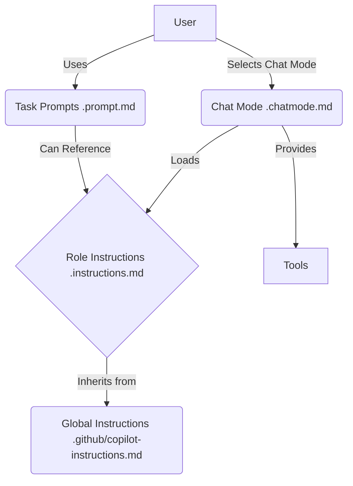
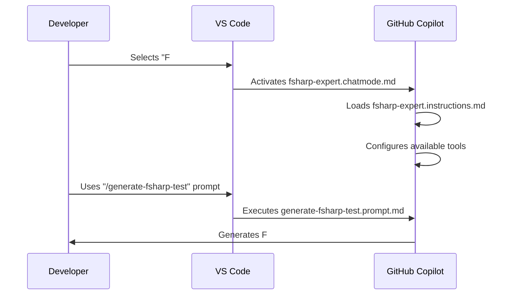

# Multi-Agent Role-Based Strategy for GitHub Copilot in VS Code

This document outlines a strategy for creating and using multiple role-based agents within a single repository using GitHub Copilot in Visual Studio Code. This approach leverages the customization features of Copilot to create specialized "agents" for different development tasks.

## Core Concepts

The strategy is based on combining several of Copilot's customization features to define and switch between different roles.

* **[Global Instructions (`.github/copilot-instructions.md`)](https://code.visualstudio.com/docs/copilot/copilot-customization#_use-a-githubcopilot-instructionsmd-file):** A baseline of instructions that applies to all roles, ensuring consistency across the repository.
* **[Role-Specific Instructions (`.instructions.md`)](https://code.visualstudio.com/docs/copilot/copilot-customization#_use-instructionsmd-files):** Detailed instructions tailored to a specific role, such as an "F# Expert" or a "Documentation Specialist."
* **[Task-Specific Prompts (`.prompt.md`)](https://code.visualstudio.com/docs/copilot/copilot-customization#_prompt-files-experimental):** Reusable prompts for common tasks associated with a role.
* **[Custom Chat Modes (`.chatmode.md`)](https://code.visualstudio.com/docs/copilot/chat/chat-modes#_custom-chat-modes):** The primary mechanism for switching between roles, tying together role-specific instructions and tools.

## Architecture Overview

The following diagram illustrates the relationship between the different components of this strategy.



## Implementation Strategy

### 1. Global Instructions

Create a `.github/copilot-instructions.md` file at the root of the repository. This file should contain high-level instructions and principles that apply to all roles.

**Example:**

```markdown
# Global Copilot Instructions

- Always write code that is idiomatic to the language.
- Prioritize readability and maintainability.
- Include comments to explain complex logic.
```

### 2. Role-Specific Instructions

For each role, create a dedicated `.instructions.md` file in a designated directory, such as `.github/instructions`.

**Example: `fsharp-expert.instructions.md`**

```markdown
---
description: "Instructions for the F# Expert role."
applyTo: "**/*.fs"
---
# F# Expert Instructions

- Prioritize functional programming patterns.
- Use F#'s type system to ensure correctness.
- Follow the F# style guide.
```

### 3. Task-Specific Prompts

Create `.prompt.md` files for common tasks associated with each role in a directory like `.github/prompts`.

**Example: `generate-fsharp-test.prompt.md`**

```markdown
---
description: "Generate an XUnit test for an F# function."
---
# Generate F# Test

Generate an XUnit test for the following F# function.

[Link to fsharp-expert.instructions.md]
```

### 4. Custom Chat Modes

Create a `.chatmode.md` file for each role in a directory like `.github/chatmodes`. This file ties together the role's instructions and the tools it should use.

**Example: `fsharp-expert.chatmode.md`**

```markdown
---
description: "A chat mode for an F# programming expert."
tools: ['codebase', 'fsharp-mcp-tools']
---
# F# Expert Mode

You are an expert F# programmer. Your goal is to write high-quality, idiomatic F# code.

[Link to fsharp-expert.instructions.md]
```

## Workflow

The following diagram illustrates the developer workflow for using this multi-agent strategy.



By following this strategy, you can create a powerful and flexible development environment with specialized AI assistants for various tasks, all within the same repository.

## Role Design Considerations

### Combining Related Expertise

For certain domains, it can be highly effective to combine related expertise into a single role rather than creating separate agents. This is particularly valuable when:

1. **Tight Feedback Loops**: The tasks require rapid iteration between related activities
2. **Shared Context**: Both activities require deep understanding of the same domain
3. **Workflow Efficiency**: Switching between agents would create unnecessary overhead

#### Example: Build & Fix Expert

A prime example is combining build system expertise with error diagnosis and fixing capabilities:

```markdown
---
description: "Build & Fix Expert - Build systems and error resolution specialist"
applyTo: "**/build.fsx,**/*.targets,**/*.props,**/*.csproj,**/*.fsproj"
tools: ['codebase', 'fsharp-mcp-tools', 'terminal']
---

# Build & Fix Expert

You specialize in build systems and error resolution. Your workflow:
1. Execute builds and capture errors
2. Diagnose root causes systematically  
3. Apply minimal, targeted fixes
4. Validate fixes thoroughly
5. Document successful patterns

Focus on getting existing code to work reliably rather than adding new features.

[Reference to detailed build-fix-expert.instructions.md]
```

**Benefits of this combined role:**
* **Contextual Understanding**: Knows both what should happen (build) and what went wrong (error)
* **Efficient Workflow**: Handles the complete build-fix-validate cycle without context switching
* **Specialized Knowledge**: Deep expertise in build tool error patterns and resolution strategies
* **Quality Focus**: Prioritizes working builds and reliability over perfect code

### When to Combine vs. Separate Roles

**Combine roles when:**
* Activities are tightly coupled in the development workflow
* Both require the same domain-specific knowledge
* The combined role scope remains focused and manageable
* Context switching between separate roles would be inefficient

**Keep roles separate when:**
* Activities require fundamentally different mindsets or approaches
* Combined scope would become too broad or unfocused
* Different roles might be used independently in various contexts
* Team members with different specializations would use different roles
