# FSharp.MCP.DevKit Architecture 🏗️

This document provides a comprehensive overview of the FSharp.MCP.DevKit solution's architecture, including its modular design, core components, communication patterns, and design principles.

## 🌐 System Overview

FSharp.MCP.DevKit is a **Model Context Protocol (MCP) server** that provides comprehensive F# Interactive (FSI) functionality through high-performance named pipes. This enables AI assistants and other MCP clients to execute F# code, evaluate expressions, generate documentation, manipulate code safely, and interact with a persistent F# development environment.

The system is designed with a **modular, layered architecture** that promotes separation of concerns, testability, and extensibility.

## 📂 Project Partitioning & Structure

The solution is partitioned into **six focused projects** to ensure clear separation of concerns and enable independent development and testing:

```
FSharp.MCP.DevKit/
├── src/                                    # All source projects  
│   ├── 🔧 FSharp.MCP.DevKit.Core/         # Foundation layer
│   │   ├── FSIService.fs                  # F# Interactive session management
│   │   ├── FileUtils.fs                   # File system utilities
│   │   └── Types & Configuration          # Core types and config
│   │
│   ├── 🔍 FSharp.MCP.DevKit.Analysis/     # Code intelligence layer
│   │   ├── FSharpCodeAnalysis.fs          # Syntax analysis & validation
│   │   ├── SmartSymbolDetectionService.fs # Symbol detection & resolution
│   │   └── ImprovedSymbolDetection.fs     # Enhanced position-sensitive analysis
│   │
│   ├── 📡 FSharp.MCP.DevKit.Communication/ # IPC infrastructure
│   │   ├── NamedPipeIPC.fs               # High-performance named pipes
│   │   └── PermanentReplServer.fs        # Persistent REPL server
│   │
│   ├── ✏️ FSharp.MCP.DevKit.CodeEditing/  # Code manipulation layer
│   │   ├── FSharpCodeEditing.fs          # Legacy code editing tools
│   │   └── FSharpCodeEditing_Clean.fs    # Modern atomic operations
│   │
│   ├── 📚 FSharp.MCP.DevKit.Documentation/ # Documentation generation
│   │   ├── DocGenerator.fs               # Core documentation engine
│   │   ├── DocumentationCommands.fs      # Command implementations
│   │   └── Tools/                        # Documentation tools & utilities
│   │
│   └── 🌐 FSharp.MCP.DevKit.Server/       # Application entry point
│       ├── Program.fs                    # Server initialization & hosting
│       ├── McpFsiTools.fs               # 25+ FSI & code manipulation tools
│       ├── McpDocumentationTools.fs     # 7 documentation generation tools
│       └── appsettings.json             # Server configuration
│
├── tests/                                 # Comprehensive test suite
│   ├── FSharp.MCP.DevKit.Tests.fsproj   # Unit & integration tests
│   ├── SimpleTestRunner.fsx             # F# script-based test runner
│   └── SmartSymbolDetectionServiceTests.fs # Symbol detection tests
│
├── examples/                              # Sample code & demonstrations
│   ├── CheckOutDomainModel.fsx          # Domain modeling examples
│   └── sample_documented_code.fsx       # Documentation extraction samples
│
├── docs/                                 # Comprehensive documentation
│   ├── projects/                        # Project-specific documentation
│   ├── Architecture.md                  # This document
│   ├── Features.md                      # Feature documentation
│   └── plans/                          # Development plans
│
└── FSharp.MCP.DevKit.sln               # Solution file
```

## 🏗️ Layered Architecture

The solution follows a **strict layered architecture** with clear dependency flow and separation of concerns:

### 1. 🔧 Foundation Layer - `FSharp.MCP.DevKit.Core`
**Core F# Interactive services and utilities**
- **FSI Session Management**: Persistent F# Interactive session lifecycle
- **Configuration Management**: System-wide configuration and settings
- **File Operations**: Robust file system utilities with error handling
- **Core Types**: Fundamental data structures and domain models

### 2. 🔍 Intelligence Layer - `FSharp.MCP.DevKit.Analysis`  
**Code analysis and intelligence services**
- **Symbol Detection**: Advanced symbol detection with position sensitivity
- **Syntax Analysis**: F# syntax validation and error reporting
- **Structure Analysis**: Code organization and dependency analysis
- **Type Information**: Comprehensive type analysis and inference

### 3. 📡 Communication Layer - `FSharp.MCP.DevKit.Communication`
**High-performance inter-process communication**
- **Named Pipe IPC**: Cross-platform named pipe implementation
- **Concurrent Processing**: Multi-threaded request handling
- **REPL Server**: Persistent REPL server with session management
- **Protocol Handling**: Robust communication protocol implementation

### 4. ✏️ Manipulation Layer - `FSharp.MCP.DevKit.CodeEditing`
**Safe code manipulation and editing**
- **Atomic Operations**: All-or-nothing file operations with rollback
- **Fantomas Integration**: Deep integration with F# code formatting
- **Safety Validation**: AST validation and context checking
- **Preview Capabilities**: Non-destructive preview of code changes

### 5. 📚 Documentation Layer - `FSharp.MCP.DevKit.Documentation`
**Comprehensive API documentation generation**
- **Package Analysis**: .NET assembly reflection and analysis
- **XML Documentation**: Integration with XML documentation comments
- **Markdown Generation**: Rich markdown API reference output
- **Search & Discovery**: Intelligent documentation search capabilities

### 6. 🌐 Application Layer - `FSharp.MCP.DevKit.Server`
**MCP server implementation and tool hosting**
- **MCP Protocol**: Full Model Context Protocol implementation
- **Tool Registration**: Dynamic tool registration and discovery
- **Request Routing**: Intelligent routing of requests to handlers
- **Error Management**: Comprehensive error handling and reporting

## 🔄 Component Interaction & Data Flow

```mermaid
graph TB
    subgraph "🤖 External Systems"
        AI["`**AI Assistants**
        Claude, GPT, etc.`"]
        IDE["`**Development Tools**
        VS Code, IDEs`"]
    end
    
    subgraph "📡 Protocol Layer"
        MCP["`**MCP Server**
        JSON-RPC Protocol
        Stdio Transport`"]
    end
    
    subgraph "🌐 Application Layer"
        Server["`**Server Host**
        Tool Registration
        Request Routing
        Error Handling`"]
        
        FSITools["`**FSI Tools**
        25+ Code Tools
        Session Management`"]
        
        DocTools["`**Documentation Tools**
        7+ Documentation Tools
        Package Analysis`"]
    end
    
    subgraph "🛠️ Service Layers"
        Documentation["`**📚 Documentation**
        Package Analysis
        API Reference
        Search & Discovery`"]
        
        CodeEditing["`**✏️ Code Editing**
        Safe Insertion
        Fantomas Integration
        Atomic Operations`"]
        
        Communication["`**📡 Communication**
        Named Pipes
        REPL Server
        Concurrent Processing`"]
        
        Analysis["`**🔍 Analysis**
        Symbol Detection
        Syntax Validation
        Structure Analysis`"]
    end
    
    subgraph "🔧 Foundation Layer"
        Core["`**FSharp.MCP.DevKit.Core**
        FSI Session Management
        File Operations
        Configuration`"]
    end
    
    subgraph "🔗 External Dependencies"
        FCS["`**F# Compiler Services**
        Compilation & Type Checking`"]
        Fantomas["`**Fantomas**
        Code Formatting`"]
        FSI["`**F# Interactive**
        Code Execution`"]
        Reflection["`**.NET Reflection**
        Assembly Analysis`"]
    end
    
    %% Client connections
    AI <--> MCP
    IDE <--> MCP
    MCP <--> Server
    
    %% Tool connections
    Server --> FSITools
    Server --> DocTools
    
    %% Service layer connections
    FSITools --> CodeEditing
    FSITools --> Communication
    FSITools --> Analysis
    DocTools --> Documentation
    Documentation --> Analysis
    CodeEditing --> Analysis
    Communication --> Core
    CodeEditing --> Core
    Analysis --> Core
    Documentation --> Core
    
    %% External dependencies
    Core --> FCS
    Core --> FSI
    CodeEditing --> Fantomas
    Analysis --> FCS
    Documentation --> FCS
    Documentation --> Reflection
    
    %% Styling
    classDef external fill:#4B0082,stroke:#ffffff,stroke-width:2px,color:#ffffff
    classDef protocol fill:#8B0000,stroke:#ffffff,stroke-width:2px,color:#ffffff
    classDef application fill:#000080,stroke:#ffffff,stroke-width:2px,color:#ffffff
    classDef service fill:#006400,stroke:#ffffff,stroke-width:2px,color:#ffffff
    classDef foundation fill:#2F4F4F,stroke:#ffffff,stroke-width:2px,color:#ffffff
    classDef dependency fill:#FF8C00,stroke:#000000,stroke-width:2px,color:#000000
    
    class AI,IDE external
    class MCP protocol
    class Server,FSITools,DocTools application
    class Documentation,CodeEditing,Communication,Analysis service
    class Core foundation
    class FCS,Fantomas,FSI,Reflection dependency
```



## 🔧 Core Components

### 🎯 FSI Service Architecture
- **`FsiService`**: Wraps F# Compiler Services for interactive evaluation
- **Session Management**: Persistent state across multiple tool invocations
- **Error Recovery**: Comprehensive error handling and session recovery
- **Performance Monitoring**: Execution timing and resource tracking

### 📡 Communication Infrastructure
- **`PipeServer/PipeClient`**: High-performance named pipe implementation
- **Cross-Platform**: Unix domain sockets on non-Windows platforms
- **Concurrent Safety**: Thread-safe operations with proper synchronization
- **Connection Pooling**: Efficient connection management and reuse

### 🌐 MCP Integration
- **`FsiMcpService`**: Manages FSI session lifecycle within MCP context
- **Tool Registration**: Dynamic registration of 30+ specialized tools
- **Request Processing**: Asynchronous request processing with proper error handling
- **State Coordination**: Proper state management across tool boundaries

### 📚 Documentation Engine
- **Reflection Analysis**: Deep .NET assembly analysis using reflection
- **XML Documentation**: Integration with XML documentation comments
- **Markdown Generation**: Rich, navigable markdown output
- **Search & Indexing**: Full-text search with context-aware results

## 🏛️ Key Design Principles

### 🔄 **Modular Design**
- Each project has a **single responsibility** and clear interfaces
- **Plugin-style architecture** for adding new MCP tools
- **Loose coupling** between components with dependency injection

### 📈 **Dependency Inversion**
- Higher layers depend on **abstractions**, not implementations
- **Interface-based design** for testability and flexibility
- **Inversion of control** for component lifecycle management

### 🛡️ **Concurrent Safety**
- **Thread-safe operations** with proper synchronization primitives
- **Immutable data structures** where possible
- **Actor-pattern inspired** message passing for complex operations

### 🚨 **Error Recovery & Resilience**
- **Comprehensive error handling** at every layer
- **Graceful degradation** when services are unavailable
- **Diagnostic reporting** with actionable error messages
- **Automatic recovery** from transient failures

### 🔧 **Extensibility & Performance**
- **Hot-swappable components** for development flexibility
- **Optimized for AI workflows** with batch operations
- **Memory-efficient operations** for large codebases
- **Caching strategies** for frequently accessed data

## 🌊 Communication Patterns

### 🔄 **Request-Response Pattern**
- MCP requests are routed to appropriate tool handlers
- **Asynchronous processing** with proper cancellation support
- **Result serialization** with comprehensive error information

### 📨 **Event-Driven Architecture**
- FSI session events propagated to interested components
- **File system monitoring** for code change detection
- **State change notifications** for UI and tooling updates

### 🔗 **Pipeline Architecture**
- Code manipulation operations use **pipeline patterns**
- **Validation stages** with early termination on errors
- **Transformation chains** for complex code operations

## 🎯 Performance Characteristics

### ⚡ **High-Performance Features**
- **Named pipe IPC**: Sub-millisecond communication latency
- **Concurrent processing**: Multiple simultaneous operations
- **Optimized serialization**: Efficient data transfer protocols
- **Connection pooling**: Reduced connection overhead

### 📊 **Scalability Considerations**
- **Thread-safe operations**: Support for concurrent clients
- **Resource management**: Proper cleanup and resource disposal
- **Memory optimization**: Efficient memory usage patterns
- **Caching strategies**: Intelligent caching for frequently accessed data

This architecture ensures the FSharp.MCP.DevKit provides a robust, scalable, and maintainable foundation for F# development workflows through the Model Context Protocol.
