# Terminal Code Execution & Session Targeting 🎯

## Overview

The FSharp.MCP.DevKit provides a sophisticated system for executing F# code across multiple terminals and FSI sessions. This document details the technical implementation, targeting mechanisms, and integration strategies for seamless F# development with AI assistants.

## 🏗️ Architecture Overview

### Core Components

```mermaid
graph TB
    subgraph "🤖 AI Assistant Layer"
        Assistant["`**GitHub Copilot / Claude**
        • Natural Language Requests
        • Code Generation
        • Multi-Terminal Awareness`"]
    end
    
    subgraph "🛡️ VS Code Security Layer"
        AutoApproval["`**Terminal Auto-Approval**
        • Whitelisted Commands
        • Security Validation
        • Prompt Bypass`"]
    end
    
    subgraph "📜 PowerShell Script Layer"
        Scripts["`**Execution Scripts**
        • fsi-exec.ps1 (Basic)
        • fsi-smart.ps1 (Intelligent)
        • fsi-discover.ps1 (Discovery)
        • fsi-exec-session.ps1 (Named)
        • fsi-exec-terminal.ps1 (Indexed)`"]
    end
    
    subgraph "🎯 Targeting System"
        Router["`**Session Router**
        • Terminal Index Resolution
        • Session Name Mapping
        • Current Context Detection
        • Smart Fallbacks`"]
    end
    
    subgraph "📡 MCP Integration Layer"
        MCPTools["`**MCP F# Tools**
        • ExecuteFSharpCode
        • ExecuteFSharpCodeDetailed
        • GetFSIState
        • Session Management`"]
    end
    
    subgraph "🔧 F# Interactive Sessions"
        FSISessions["`**Multiple FSI Sessions**
        • Default Session
        • Project-Specific Sessions
        • Temporary Sandboxes
        • Named Workspaces`"]
    end
    
    %% Connections
    Assistant --> AutoApproval
    AutoApproval --> Scripts
    Scripts --> Router
    Router --> MCPTools
    MCPTools --> FSISessions
    
    %% Styling
    classDef aiLayer fill:#4B0082,stroke:#ffffff,stroke-width:3px,color:#ffffff
    classDef securityLayer fill:#8B0000,stroke:#ffffff,stroke-width:2px,color:#ffffff
    classDef scriptLayer fill:#000080,stroke:#ffffff,stroke-width:2px,color:#ffffff
    classDef targetingLayer fill:#006400,stroke:#ffffff,stroke-width:2px,color:#ffffff
    classDef mcpLayer fill:#2F4F4F,stroke:#ffffff,stroke-width:2px,color:#ffffff
    classDef fsiLayer fill:#FF8C00,stroke:#000000,stroke-width:2px,color:#000000
    
    class Assistant aiLayer
    class AutoApproval securityLayer
    class Scripts scriptLayer
    class Router targetingLayer
    class MCPTools mcpLayer
    class FSISessions fsiLayer
```



## 🚀 Execution Scripts

### 1. Basic Execution Script (`fsi-exec.ps1`)

The foundational script that provides flexible targeting options for F# code execution.

#### Parameters

| Parameter | Type | Default | Description |
|-----------|------|---------|-------------|
| `Code` | `string` | **Required** | F# code to execute |
| `Detailed` | `switch` | `false` | Enable detailed error reporting |
| `TerminalId` | `string` | `"default"` | Named terminal identifier |
| `SessionName` | `string` | `""` | Specific FSI session name |
| `TerminalIndex` | `int` | `-1` | Numeric terminal index |

#### Targeting Logic

```powershell
# Priority order for target resolution:
if ($SessionName -ne "") {
    $targetInfo = "Session: $SessionName"           # 1. Named session (highest priority)
} elseif ($TerminalIndex -ge 0) {
    $targetInfo = "Terminal Index: $TerminalIndex" # 2. Terminal index
} else {
    $targetInfo = "Terminal ID: $TerminalId"       # 3. Default terminal ID
}
```

#### Usage Examples

```powershell
# Basic execution (default session)
fsi-exec.ps1 "let x = 42; printfn \"x = %d\" x"

# Target specific session
fsi-exec.ps1 "List.sum [1..10]" -SessionName "project-analysis"

# Target by terminal index
fsi-exec.ps1 "printfn \"Hello World\"" -TerminalIndex 1

# Detailed error reporting
fsi-exec.ps1 "let invalid = " -Detailed
```

### 2. Session-Specific Script (`fsi-exec-session.ps1`)

Designed for explicit session targeting with mandatory session name specification.

#### Key Features

- **Mandatory Session Targeting**: Requires explicit session name
- **Session Validation**: Validates session existence before execution
- **Enhanced Logging**: Detailed session-specific logging

```powershell
#!/usr/bin/env pwsh
param(
    [Parameter(Mandatory=$true, Position=0)]
    [string]$Code,
    
    [Parameter(Mandatory=$true, Position=1)]
    [string]$SessionName,
    
    [Parameter(Mandatory=$false)]
    [switch]$Detailed = $false
)
```

### 3. Terminal Index Script (`fsi-exec-terminal.ps1`)

Targets terminals by numeric index for precise terminal control.

#### Terminal Index Mapping

| Index | Terminal Type | Description |
|-------|---------------|-------------|
| `0` | PowerShell | Main PowerShell terminal |
| `1` | F# Interactive | Dedicated FSI terminal |
| `2` | Git Bash | Git operations terminal |
| `3` | Command Prompt | Legacy command terminal |

### 4. Smart Execution Script (`fsi-smart.ps1`)

Intelligent execution with context awareness and automatic fallbacks.

#### Smart Features

- **Context Detection**: Automatically detects current terminal context
- **Intelligent Fallbacks**: Falls back to sensible defaults
- **Usage Analytics**: Tracks execution patterns for optimization

```powershell
# Smart targeting options
param(
    [string]$Code,
    [switch]$UseCurrent = $false,    # Use current terminal context
    [string]$Target = "default"      # Named target with fallback
)
```

### 5. Discovery Script (`fsi-discover.ps1`)

Session and terminal discovery tool for environment inspection.

#### Discovery Capabilities

```powershell
# List available F# sessions
fsi-discover.ps1 -ListSessions

# Show terminal information
fsi-discover.ps1 -ListTerminals

# Display active session status
fsi-discover.ps1 -ShowActive
```

## 🎯 Session Targeting Mechanisms

### 1. Named Session Targeting

Sessions are identified by logical names that map to specific F# Interactive instances.

#### Predefined Sessions

| Session Name | Purpose | Use Case |
|--------------|---------|----------|
| `default` | Main development session | General F# development |
| `project-analysis` | Code analysis workspace | Static analysis, metrics |
| `temp-sandbox` | Temporary experiments | Quick tests, prototyping |
| `documentation` | Doc generation context | API documentation |
| `testing` | Test execution environment | Unit tests, validation |

#### Session Configuration

```fsharp
// Example session configuration
type SessionConfig = {
    Name: string
    WorkingDirectory: string
    PreloadedModules: string list
    ReferenceAssemblies: string list
    NuGetPackages: string list
    Timeout: TimeSpan option
}

let defaultSession = {
    Name = "default"
    WorkingDirectory = Environment.CurrentDirectory
    PreloadedModules = ["FSharp.Core"]
    ReferenceAssemblies = []
    NuGetPackages = []
    Timeout = None
}
```

### 2. Terminal Index Targeting

Direct terminal access through numeric indexing for precise control.

#### Index Resolution Logic

```powershell
function Resolve-TerminalIndex {
    param([int]$Index)
    
    $terminals = Get-VSCodeTerminals  # Hypothetical function
    
    if ($Index -ge 0 -and $Index -lt $terminals.Count) {
        return $terminals[$Index]
    } else {
        throw "Terminal index $Index not found. Available: 0-$($terminals.Count - 1)"
    }
}
```

### 3. Current Context Detection

Automatic detection of the current terminal and session context.

#### Context Detection Algorithm

```powershell
function Get-CurrentContext {
    # 1. Check if current terminal has active FSI session
    $currentTerminal = Get-ActiveTerminal
    if (Test-FSISession -Terminal $currentTerminal) {
        return @{
            Type = "Terminal"
            Id = $currentTerminal.Id
            Session = Get-FSISession -Terminal $currentTerminal
        }
    }
    
    # 2. Check for default session
    $defaultSession = Get-DefaultFSISession
    if ($defaultSession) {
        return @{
            Type = "Session"
            Session = $defaultSession
        }
    }
    
    # 3. Create new session if none found
    return New-FSISession -Name "auto-created"
}
```

## 🔗 MCP Integration

### Tool Enhancement for Multi-Session Support

The existing MCP tools need enhancement to support session targeting:

#### Enhanced ExecuteFSharpCode Tool

```fsharp
type ExecuteRequest = {
    Code: string
    SessionTarget: SessionTarget option
    DetailedErrors: bool
}

and SessionTarget =
    | SessionName of string
    | TerminalIndex of int
    | CurrentContext
    | Default

let executeFSharpCode (request: ExecuteRequest) =
    let session = 
        match request.SessionTarget with
        | Some (SessionName name) -> getSessionByName name
        | Some (TerminalIndex index) -> getSessionByTerminalIndex index
        | Some CurrentContext -> getCurrentSession()
        | _ -> getDefaultSession()
    
    session.ExecuteCode(request.Code, request.DetailedErrors)
```

#### Session Management Tools

```fsharp
// New MCP tools for session management
let listActiveSessions () = // List all active FSI sessions
let createSession (name: string) (config: SessionConfig) = // Create named session
let destroySession (name: string) = // Cleanup session
let getSessionInfo (name: string) = // Get session status and bindings
```

## 🛡️ Security and Whitelisting

### VS Code Terminal Auto-Approval Configuration

```json
{
  "github.copilot.chat.agent.terminal.allowList": {
    "fsi-exec.ps1": true,
    "fsi-exec-session.ps1": true,
    "fsi-exec-terminal.ps1": true,
    "fsi-discover.ps1": true,
    "fsi-smart.ps1": true,
    "pwsh": true,
    "dotnet": true
  }
}
```

### Security Considerations

#### Command Validation

```powershell
function Validate-FSCommand {
    param([string]$Command, [string]$Code)
    
    # 1. Verify command is whitelisted
    $allowedCommands = @("fsi-exec.ps1", "fsi-smart.ps1", "fsi-discover.ps1")
    if ($Command -notin $allowedCommands) {
        throw "Command '$Command' is not whitelisted"
    }
    
    # 2. Basic F# syntax validation
    if ($Code -match "System\.IO\.File\.Delete|rm\s+-rf|del\s+/f") {
        throw "Potentially dangerous operations detected"
    }
    
    # 3. Length validation
    if ($Code.Length -gt 10000) {
        throw "Code length exceeds maximum allowed size"
    }
    
    return $true
}
```

#### Execution Sandboxing

```fsharp
type ExecutionSandbox = {
    AllowedNamespaces: string list
    AllowedAssemblies: string list
    TimeoutMs: int
    MemoryLimitMB: int
}

let defaultSandbox = {
    AllowedNamespaces = [
        "System"
        "System.Collections"
        "System.Linq"
        "FSharp.Core"
        "Microsoft.FSharp"
    ]
    AllowedAssemblies = [
        "mscorlib"
        "System.Core"
        "FSharp.Core"
    ]
    TimeoutMs = 30000
    MemoryLimitMB = 100
}
```

## 🔄 Workflow Integration

### AI Assistant Workflow


### Error Handling Workflow


## 📊 Performance Considerations

### Session Lifecycle Management

```fsharp
type SessionState =
    | Initializing
    | Ready
    | Executing
    | Error of string
    | Disposed

type SessionManager() =
    let sessions = ConcurrentDictionary<string, FSISession>()
    let sessionStates = ConcurrentDictionary<string, SessionState>()
    
    member this.GetOrCreateSession(name: string) =
        sessions.GetOrAdd(name, fun _ -> 
            let session = new FSISession(name)
            sessionStates.[name] <- Initializing
            session.Initialize() |> Async.RunSynchronously
            sessionStates.[name] <- Ready
            session
        )
    
    member this.CleanupIdleSessions(idleTimeoutMinutes: int) =
        let cutoff = DateTime.Now.AddMinutes(-idleTimeoutMinutes)
        sessions
        |> Seq.filter (fun kvp -> kvp.Value.LastActivity < cutoff)
        |> Seq.iter (fun kvp -> 
            this.DisposeSession(kvp.Key)
        )
```

### Execution Optimization

#### Caching Strategy

```fsharp
type ExecutionCache = {
    CompiledExpressions: ConcurrentDictionary<string, obj>
    TypeCheckResults: ConcurrentDictionary<string, FSharpCheckFileResults>
    mutable LastCleanup: DateTime
}

let cacheExecutionResult (code: string) (result: obj) (cache: ExecutionCache) =
    let hash = code.GetHashCode().ToString()
    cache.CompiledExpressions.[hash] <- result
    
    // Periodic cleanup
    if DateTime.Now - cache.LastCleanup > TimeSpan.FromMinutes(10.0) then
        cleanupCache cache
        cache.LastCleanup <- DateTime.Now
```

#### Parallel Session Management

```fsharp
let executeInParallel (requests: ExecuteRequest list) =
    requests
    |> List.groupBy (fun req -> req.SessionTarget)
    |> List.map (fun (sessionTarget, sessionRequests) ->
        async {
            let session = resolveSession sessionTarget
            return! 
                sessionRequests
                |> List.map (fun req -> session.ExecuteAsync(req.Code))
                |> Async.Parallel
        }
    )
    |> Async.Parallel
    |> Async.RunSynchronously
    |> Array.concat
```

## 🔧 Configuration and Customization

### Script Configuration File

```json
{
  "fsiExecution": {
    "defaultSession": "default",
    "sessionTimeout": "00:30:00",
    "enableDetailedLogging": true,
    "maxConcurrentSessions": 5,
    "autoCreateSessions": true,
    "sessionCleanupInterval": "00:10:00",
    "allowedNamespaces": [
      "System",
      "System.Collections",
      "FSharp.Core",
      "Microsoft.FSharp"
    ],
    "securitySettings": {
      "validateSyntax": true,
      "blockFileOperations": true,
      "maxCodeLength": 10000,
      "executionTimeout": "00:00:30"
    }
  }
}
```

### Environment Variables

| Variable | Description | Default |
|----------|-------------|---------|
| `FSHARP_MCP_SESSION_TIMEOUT` | Session timeout in minutes | `30` |
| `FSHARP_MCP_MAX_SESSIONS` | Maximum concurrent sessions | `5` |
| `FSHARP_MCP_DETAILED_LOGGING` | Enable detailed logging | `false` |
| `FSHARP_MCP_AUTO_CLEANUP` | Auto cleanup idle sessions | `true` |

## 🚀 Future Enhancements

### Planned Features

1. **Visual Session Management**
   - GUI for session monitoring
   - Real-time session status
   - Interactive session browser

2. **Advanced Targeting**
   - Regex-based session selection
   - Tag-based session grouping
   - Geographic session distribution

3. **Integration Improvements**
   - FAKE build system integration
   - Docker container sessions
   - Remote session support

4. **AI Enhancement**
   - Context-aware session selection
   - Automatic session optimization
   - Predictive session management

### Roadmap

- **Q3 2025**: Visual session management UI
- **Q4 2025**: Remote session support
- **Q1 2026**: Advanced AI integration
- **Q2 2026**: Container-based isolation

## 📖 Related Documentation

- [Architecture Overview](Architecture.md)
- [MCP Tools Reference](Features.md)
- [Agent Development Strategies](Agent-Instructions-Strategies/)
- [F# Code Editing](FSharpCodeEditing.md)
- [Communication Layer](projects/Communication/)

---

*This documentation covers the technical implementation of multi-terminal F# code execution in the FSharp.MCP.DevKit. For implementation details and code examples, refer to the `/scripts/` directory.*
