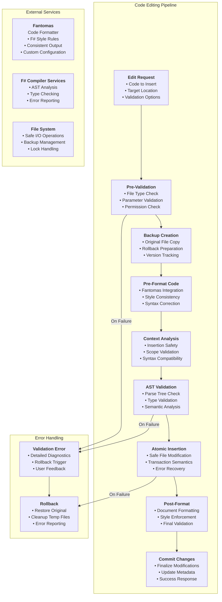

# FSharp.MCP.DevKit.CodeEditing

`FSharp.MCP.DevKit.CodeEditing` provides sophisticated F# code manipulation and editing capabilities with enterprise-grade safety features. This project implements advanced code injection, formatting, and validation tools that enable safe programmatic modification of F# source files while maintaining code integrity and syntactic correctness.

## Overview

The CodeEditing project provides:

- Safe F# code insertion with AST validation.
- Code formatting integration with Fantomas.
- Structure analysis and dependency tracking.
- Preview capabilities for code changes.
- Type-safe code manipulation tools.

## Architecture

The CodeEditing project implements a multi-layered code manipulation architecture:

- **Safe Code Injection**: Context-aware code insertion with comprehensive validation.
- **Atomic Operations**: All-or-nothing code modifications with rollback capabilities.
- **Format Integration**: Deep integration with Fantomas for consistent code formatting.
- **Validation Pipeline**: Multi-stage validation with AST analysis and type checking.
- **Error Recovery**: Robust error handling with detailed diagnostic reporting.



## Available Tools

The code injection tools provide a safe and reliable way to programmatically modify F# script files.

### 1. TryInsertCode (Safe Injection)

**Purpose**: Safely insert F# code into a script file with full AST validation and type checking.

**Signature**:

```fsharp
TryInsertCode(fsiService, newCode, filePath, ?insertAtLine)
```

**Features**:

- Full AST parsing and validation before insertion.
- Type checking to ensure code validity.
- Comprehensive error and warning reporting.
- Rollback on validation failure.

### 2. InsertCode (Unified Code Insertion)

**Purpose**: Insert F# code with comprehensive features including formatting, optional validation, and atomic operations.

**Signature**:

```fsharp
InsertCode(newCode, filePath, insertAtLine, insertAtColumn, ?shouldFormat, ?shouldValidate)
```

**Features**:

- **Pre-formatting**: Code is formatted before insertion
- **Optional validation**: Validation is disabled by default for better performance with large code pieces
- **Column positioning**: Precise indentation control
- **Atomic operations**: Safe file operations with backup and rollback
- **Post-formatting**: Document-level formatting after insertion
- **Comprehensive diagnostics**: Detailed reporting when validation is enabled

**Default Behavior**:

- `shouldFormat = true` - Code will be formatted
- `shouldValidate = false` - Validation is skipped for better performance with large code blocks

**When to enable validation**:

- Small code snippets where validation overhead is acceptable
- Critical insertions where syntax correctness must be verified
- Development/testing scenarios where detailed diagnostics are needed

### 3. PreviewCodeInjection

**Purpose**: Preview what the file will look like after code injection without actually modifying it.

**Signature**:

```fsharp
PreviewCodeInjection(fsiService, newCode, filePath, ?insertAtLine)
```

**Features**:

- Shows complete file content with injection markers.
- No file modification.

## Implementation Report Summary

The code insertion functionality was significantly refactored to address several critical issues:

- **Error String Injection Bug**: Fixed a bug where validation error messages were being written to files, causing corruption.
- **Inconsistent Error Handling**: Unified error handling to use a `Result` type for predictable outcomes.
- **Line Numbering Issues**: Corrected line splitting logic to handle empty lines properly, ensuring accurate insertion.
- **Unsafe File Operations**: Implemented atomic writes and file backups to prevent data loss.
- **Refactoring**: Replaced three separate insertion functions with a single, robust `InsertCode` tool that handles validation, formatting, and file operations safely.

## Related Projects

- [Core](../Core/) - F# Interactive core services
- [Server](../Server/) - MCP server implementation
- [Communication](../Communication/) - IPC and communication protocols
- [Analysis](../Analysis/) - Code analysis and symbol detection
- [Documentation](../Documentation/) - Documentation generation tools
