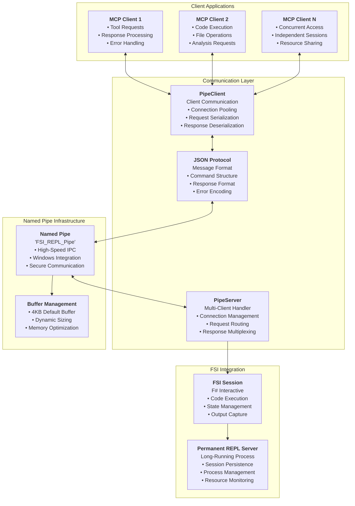

# FSharp.MCP.DevKit.Communication

`FSharp.MCP.DevKit.Communication` provides high-performance inter-process communication (IPC) infrastructure for the FSharp.MCP.DevKit solution. It implements a sophisticated named pipe-based communication system that enables reliable, concurrent communication with F# Interactive sessions and provides a persistent REPL server architecture.

## Overview

The Communication project provides:
- Named pipe communication for FSI
- High-performance IPC protocols
- File system operations and monitoring
- Stream processing and buffering
- Concurrent communication handling

## Architecture

The Communication project implements a client-server architecture with:
- **Named Pipe Infrastructure**: High-performance Windows named pipe communication
- **JSON-based Protocol**: Structured message format with rich diagnostics
- **Concurrent Processing**: Thread-safe multi-client support
- **Persistent Sessions**: Long-running REPL server with session management
- **Error Recovery**: Robust error handling and connection recovery mechanisms

## File Handling Implementation Report

Critical file handling bugs were identified and fixed, addressing issues that caused file corruption, content duplication, and syntax errors.

### Root Cause Analysis

-   **Flawed Line Splitting and Joining**: Incorrect handling of `\r\n` line endings led to content duplication and incorrect line positioning.
-   **Aggressive `RemoveEmptyEntries`**: This option stripped blank lines from new code, corrupting formatting and logic.
-   **Misleading Previews**: The preview function did not accurately reflect how code would be inserted.

### Fixes Implemented

-   **Safe Line Handling**: New helper functions (`splitLinesPreservingLineEndings`, `joinLinesWithConsistentEndings`) were added to correctly handle different line endings.
-   **Context-Aware Insertion**: Validation was added to prevent insertions in the middle of multi-line constructs.
-   **Consistent Line Endings**: All file I/O now uses `\n` for consistency.

## Related Projects

- [Core](../Core/) - F# Interactive core services
- [Server](../Server/) - MCP server implementation
- [CodeEditing](../CodeEditing/) - Code manipulation tools
- [Analysis](../Analysis/) - Code analysis capabilities
- [Documentation](../Documentation/) - Documentation generation
