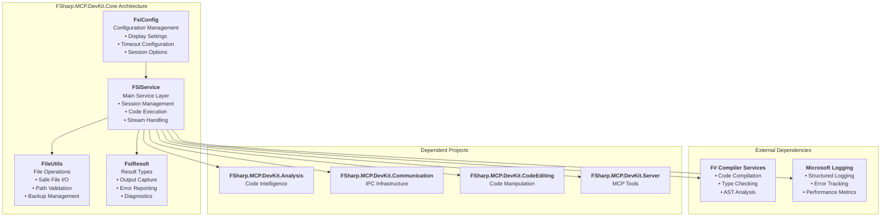

# FSharp.MCP.DevKit.Core

`FSharp.MCP.DevKit.Core` is the foundational layer of the FSharp.MCP.DevKit solution, providing essential services for F# Interactive (FSI) session management, file system operations, and core data structures. This project serves as the base dependency for all other components in the solution.

## Overview

The Core project provides:
- F# Interactive session management
- Code execution and evaluation services
- Script loading and management
- Assembly and package reference handling
- Expression evaluation with type information

## Architecture

The Core project follows a clean architecture pattern with:
- **Configuration Management**: Centralized configuration for FSI sessions
- **Service Abstraction**: High-level wrappers around F# Compiler Services
- **Resource Management**: Proper disposal and lifecycle management
- **Error Handling**: Comprehensive error reporting with diagnostics

## FSIService Refactoring Plan

The `FSIService` was refactored to standardize on `Task` instead of `Async` for asynchronous operations to improve interoperability and performance.

### Changes Implemented

-   **`ExecuteInteractionAsync`**, **`ExecuteScript`**, and **`Execute`** methods were updated to return `Task<FsiResult>` instead of `Async<FsiResult>`.
-   Implementations were converted to use `task { ... }` computation expressions.
-   Error handling and diagnostics were preserved within the new `Task`-based workflow.

## Tool Testing After Refactoring

All core MCP tools were tested after the refactoring to ensure continued functionality. Key tools tested include:

-   `mcp_fsharp_fsi_mc_AddSearchPath`
-   `mcp_fsharp_fsi_mc_AnalyzeCodeStructure`
-   `mcp_fsharp_fsi_mc_ExecuteFSharpCode`
-   `mcp_fsharp_fsi_mc_InsertCode`
-   `mcp_fsharp_fsi_mc_LoadFSharpScript`
-   `mcp_fsharp_fsi_mc_ReferenceNuGetPackage`
-   `mcp_fsharp_fsi_mc_ResetFSISession`

All tests passed, confirming the success of the refactoring.

## Related Projects

- [Server](../Server/) - MCP server implementation
- [Communication](../Communication/) - IPC and communication protocols
- [CodeEditing](../CodeEditing/) - Code manipulation and insertion
- [Analysis](../Analysis/) - Code analysis and symbol detection
- [Documentation](../Documentation/) - Documentation generation tools
