# FSharp.MCP.DevKit.Documentation

`FSharp.MCP.DevKit.Documentation` is a comprehensive API documentation generator for .NET assemblies and NuGet packages. It provides reflection-based analysis, XML documentation integration, and professional markdown output generation for the FSharp.MCP.DevKit solution.

## Overview

The Documentation project provides:

- **NuGet Package Documentation**: Generate docs for any NuGet package by name
- **Project Documentation**: Generate docs for all packages in an F# project file
- **Assembly Analysis**: Comprehensive reflection-based analysis of .NET assemblies
- **XML Documentation Integration**: Full parsing and integration of XML documentation files
- **Rich Markdown Output**: Professional API reference documentation generation
- **Multi-Language Support**: Support for F#, C#, and other .NET languages
- **Command-Line Tool**: Global .NET tool for documentation generation
- **Library Integration**: Programmatic API for F# Interactive usage

## Architecture

The Documentation project follows a modular architecture with:

- **Core Services**: Package analysis and documentation generation
- **XML Integration**: Complete XML documentation parsing
- **Output Rendering**: Professional markdown generation
- **Tool Integration**: Command-line and library interfaces

```mermaid
graph TB
    subgraph "FSharp.MCP.DevKit.Documentation Architecture"
        PackageDoc["`**PackageDocService**<br/>Core Service Layer<br/>• Package Analysis<br/>• Documentation Generation<br/>• Assembly Processing`"]
        XmlParser["`**XmlDocumentationParser**<br/>XML Integration<br/>• XML Doc Parsing<br/>• Member Name Generation<br/>• Documentation Extraction`"]
        DocModel["`**DocumentationModel**<br/>Domain Model<br/>• Rich Type System<br/>• API Representation<br/>• Metadata Structures`"]
        Markdown["`**MarkdownGenerator**<br/>Output Rendering<br/>• Professional Formatting<br/>• Cross-References<br/>• Code Highlighting`"]
    end
    
    subgraph "Tools & Commands"
        CLI["`**Command-Line Tool**<br/>Global .NET Tool<br/>• Package Documentation<br/>• Project Analysis<br/>• Batch Processing`"]
        FSI["`**Library Interface**<br/>F# Interactive<br/>• Programmatic API<br/>• REPL Integration<br/>• Development Workflow`"]
    end
    
    subgraph "External Dependencies"
        Reflection["`**System.Reflection**<br/>• Assembly Analysis<br/>• Type Inspection<br/>• Metadata Extraction`"]
        NuGet["`**NuGet APIs**<br/>• Package Discovery<br/>• Version Resolution<br/>• Dependency Management`"]
    end
    
    PackageDoc --> DocModel
    PackageDoc --> XmlParser
    DocModel --> Markdown
    
    PackageDoc --> Reflection
    PackageDoc --> NuGet
    
    PackageDoc --> CLI
    PackageDoc --> FSI
```



## Current Status

### ✅ **PRODUCTION READY** - All Milestones Complete

- ✅ **Milestone 1**: Foundation & Core Package Logic (COMPLETE)
- ✅ **Milestone 2**: Assembly Analysis & Documentation Generation (COMPLETE - ENHANCED)  
- ✅ **Milestone 3**: XML Documentation Integration (COMPLETE)
- ✅ **Milestone 4**: NuGet Package Management (COMPLETE - TWO-STEP PROCESS)
- ✅ **Milestone 5**: Advanced Documentation Features (COMPLETE)
- ✅ **Milestone 6**: MCP Integration & Tooling (COMPLETE - PRODUCTION READY)

**Production Status:** The system is packaged and ready for distribution with comprehensive NuGet package documentation generation available both as a library and command-line tool.

## Key Features

### ✅ Complete Implementation

1. **Enhanced Assembly Analysis** - Comprehensive reflection-based analysis with full metadata extraction
2. **XML Documentation Integration** - Complete XML doc parsing for all .NET documentation tags
3. **Rich Markdown Generation** - Professional API reference output with proper formatting
4. **Parameter Documentation** - Detailed parameter tables with XML descriptions
5. **Property Analysis** - Access modes, static flags, and comprehensive documentation
6. **Generic Type Support** - Full generic parameter tracking and display
7. **NuGet Package Management** - Automatic package discovery and dependency resolution
8. **Project File Analysis** - Extract and document all packages from .fsproj files
9. **Command-Line Interface** - Global .NET tool for standalone usage
10. **Library Interface** - Programmatic API for F# Interactive and applications
11. **🆕 Online Library Research** - Generate comprehensive library overviews with research-based descriptions, example usage, and shallow namespace trees

## Usage

### Command-Line Tool

Install the global tool:

```bash
dotnet tool install --global FSharp.MCP.DevKit.Documentation.Tool
```

Generate documentation for a NuGet package:

```bash
fsharp-docgen package Newtonsoft.Json --output ./docs
```

Generate documentation for all packages in a project:

```bash
fsharp-docgen project MyProject.fsproj --output ./docs --overwrite
```

### Library Usage in F# Interactive

```fsharp
#r "nuget: FSharp.MCP.DevKit.Documentation"
open FSharp.MCP.DevKit.Documentation.Tools

// Generate docs for a NuGet package
docGen "Newtonsoft.Json"

// Generate docs for all packages in a project file  
docGenProject "MyProject.fsproj"

// 🆕 Research and generate library overview
researchLib "System.Text.Json"
```

### New Library Research Feature

The `researchLib` function generates comprehensive library overviews that include:

- **High-level description** based on research patterns
- **Quick reference links** to official documentation and repositories  
- **Shallow namespace tree** showing typical structure
- **Example usage patterns** with common scenarios
- **AI agent usage guide** explaining when to use overviews vs detailed docs
- **Development workflow** recommendations

**Example Usage:**

```fsharp
// Generate overview for any .NET library
researchLib "Microsoft.Extensions.Logging"
// Creates: ./docs/Microsoft.Extensions.Logging-Overview.md

// The overview provides high-level understanding
// Use docGen for detailed API documentation
docGen "Microsoft.Extensions.Logging"
```

**Perfect for AI Agents:**

- Start with `researchLib` for initial library discovery
- Use `docGen` when you need specific method signatures
- Use `searchDocumentation` to find particular APIs

## Test Results

### ✅ All Tests Passed (July 2, 2025)

1. **Command-Line Tool - Single Package**: Successfully generated documentation for System.Text.Json
   - **324 types** documented, **3,792 methods**, **1,052 properties**
   - **82 markdown files** generated in **0.20 seconds**

2. **Command-Line Tool - Project Documentation**: Successfully processed 3 packages from .fsproj
   - **1,332 total types**, **13,466 total methods**, **3,509 total properties**  
   - **226 markdown files** generated in **0.61 seconds**

3. **Global Tool Installation**: Tool successfully installed and available system-wide
   - Command `fsharp-docgen` working correctly with help system

4. **Library Usage in FSI**: Both `docGen` and `docGenProject` functions working correctly

## Implementation Details

### Core Components

1. **PackageDocService** (`src/FSharp.MCP.DevKit.Documentation/Core/PackageDocService.fs`)
   - Core service interface with three main functions
   - Package discovery and analysis
   - Assembly loading and reflection analysis

2. **XmlDocumentationParser** (`src/FSharp.MCP.DevKit.Documentation/Xml/XmlDocumentationParser.fs`)
   - Production-ready XML documentation parsing
   - Support for all standard .NET XML tags: `<summary>`, `<param>`, `<returns>`, `<remarks>`, `<example>`, `<exception>`
   - Automatic XML file discovery and member name generation

3. **DocumentationModel** (`src/FSharp.MCP.DevKit.Documentation/Model/DocumentationModel.fs`)
   - Rich domain model for API documentation
   - Comprehensive type system supporting all .NET constructs
   - Error handling and validation types

4. **Command-Line Tools** (`src/FSharp.MCP.DevKit.Documentation.Tool/`)
   - Global .NET tool implementation
   - Two main commands: `package` and `project`
   - Configurable output options and formatting

### Working Test Scripts

The project includes several working validation scripts:

- `TestMilestone6Complete.fsx` - Complete end-to-end testing
- `TestDocGeneratorComplete.fsx` - Enhanced assembly analysis validation
- `FinalDocGeneratorTest.fsx` - Production readiness testing
- `ComprehensiveDocGeneratorTest.fsx` - Full feature validation

## Future Roadmap

### Next Phase: Enhanced Search & Agent Optimization

- **[Enhanced-Search-Documentation-Plan.md](Enhanced-Search-Documentation-Plan.md)** - **NEW** Design and roadmap for intelligent search capabilities and agent-optimized workflows

The next evolution focuses on:

1. **Centralized Documentation Structure** - Standardized `docs/` folder layout for all projects
2. **Intelligent Search Tools** - Agent-optimized API discovery and contextual information extraction
3. **Generate Once, Search Many** - Efficient workflow where documentation generation is infrequent but search is constant

## Documentation Files

This README consolidates information from the following detailed documentation files:

### Current Implementation

- **[Implementation-Progress.md](Implementation-Progress.md)** - Detailed milestone tracking and implementation status
- **[Milestone6-Complete.md](Milestone6-Complete.md)** - Final milestone completion summary
- **[Final-Test-Results.md](Final-Test-Results.md)** - Comprehensive test results and validation
- **[XmlDocumentationParser-Production-Status.md](XmlDocumentationParser-Production-Status.md)** - XML parser validation and status
- **[PackageDocService-Fix-Summary.md](PackageDocService-Fix-Summary.md)** - Service implementation details

### Planning & Architecture

- **[reflection-documentation-feature-plan.md](reflection-documentation-feature-plan.md)** - Original feature planning and architecture
- **[Enhanced-Search-Documentation-Plan.md](Enhanced-Search-Documentation-Plan.md)** - Future roadmap for agent-optimized documentation

## Related Projects

- [Core](../Core/) - F# Interactive core services and foundational components
- [Server](../Server/) - MCP server implementation and protocol handling
- [Communication](../Communication/) - IPC and communication protocols  
- [CodeEditing](../CodeEditing/) - Code manipulation and insertion tools
- [Analysis](../Analysis/) - Code analysis and symbol detection services
