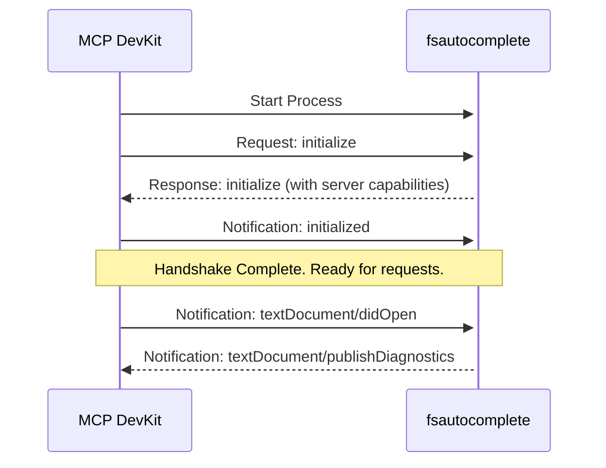
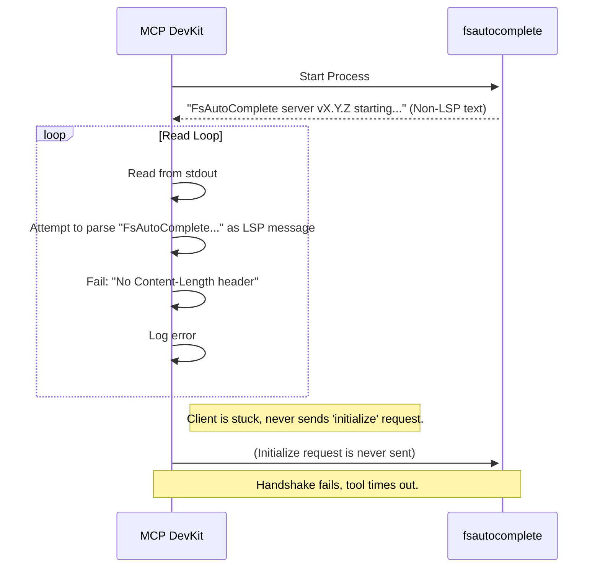
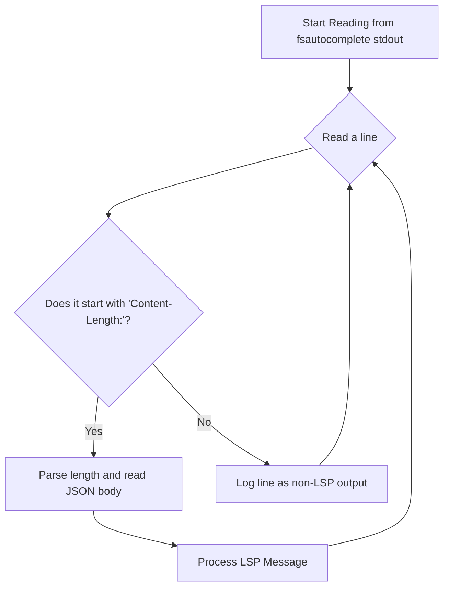

# FsAutoComplete Startup Analysis

This document details the investigation into a blocking issue and log spam encountered when using the `mcp_fsharpdevkit_StartFsAutoComplete` tool.

## 1. The Problem

When invoking `mcp_fsharpdevkit_StartFsAutoComplete`, the tool call blocks for an extended period and eventually times out. During this time, the server logs continuously produce the following warning:

```
[warning] [server stderr] warn: FSharp.MCP.DevKit.Server.FsAutoCompleteService[0]
      Failed to parse LSP message: No Content-Length header found
```

This behavior indicates a fundamental issue in the Language Server Protocol (LSP) communication layer between the MCP DevKit server and the `fsautocomplete` process it launches. The tool becomes unresponsive because the initial handshake between the client (our server) and the language server (`fsautocomplete`) fails.

## 2. Research and Findings

### 2.1. LSP Startup Sequence

The Language Server Protocol has a well-defined startup and initialization handshake. The sequence is critical for establishing a functional communication channel.

1. **Client Starts Server**: The client (in our case, the `FSharp.MCP.DevKit.Server`) launches the language server (`fsautocomplete`) as a separate process, redirecting its standard input and output.
2. **Client Sends `initialize` Request**: The client sends the first message, an `initialize` request. This request contains information about the client's capabilities, the workspace root, and other settings.
3. **Server Sends `initialize` Response**: The server processes the `initialize` request and responds with its own capabilities, such as what language features it supports (e.g., completion, go to definition, etc.).
4. **Client Sends `initialized` Notification**: After receiving the server's capabilities, the client sends an `initialized` notification to the server, confirming that the handshake is complete from the client's side.
5. **Ready for Communication**: At this point, the connection is established, and the client and server can exchange other messages like `textDocument/didOpen`, `textDocument/hover`, etc.

Here is a diagram illustrating the correct flow:



### 2.2. Analysis of Other Implementations

A review of other F# LSP client implementations reveals a common pattern for handling the `fsautocomplete` process:

* **Ionide (VS Code)**: The official F# extension for VS Code has extensive and robust handling for the `fsautocomplete` process. Its test suite (`FsAutoComplete.Tests.Lsp`) shows a client that is prepared to handle various outputs and edge cases. The client code is designed to be resilient to non-LSP output on startup.
* **vim-fsharp & emacs-fsharp-mode**: Older editor integrations often have custom logic to manage the `fsautocomplete` process. They typically include mechanisms to parse the output stream, looking for specific markers or logging initial lines that are not part of the LSP protocol, which makes their communication handling more robust against unexpected startup messages.

The key takeaway is that mature clients do not assume the `fsautocomplete` process's standard output will *only* contain pure LSP messages from the very beginning. They anticipate and handle preliminary output.

## 3. Root Cause Analysis

The issue in `FSharp.MCP.DevKit` stems from a fragile assumption in the `LspCommunication` class.

1. **The Assumption**: The code in `LspCommunication.ReadLspMessageAsync` assumes that every single byte read from the `fsautocomplete` process's standard output stream is a well-formed LSP message, starting with a `Content-Length` header.
2. **The Reality**: The `fsautocomplete` process, like many command-line tools, may write introductory information, debug logs, or error messages to its standard output upon startup. This text is not formatted as an LSP message.
3. **The Failure**: Our `LspCommunication` reader encounters this initial, non-LSP text. It tries to parse it, fails to find the `Content-Length` header, and logs the error. Because it doesn't consume the invalid text, it gets stuck in a loop, repeatedly trying and failing to parse the same initial output. This prevents it from ever reaching the actual LSP handshake messages.

The following diagram illustrates the failure mode:



## 4. Hypothesis and Proposed Solution

### Hypothesis

The `fsautocomplete` process writes non-LSP-formatted text to its standard output on startup. The `LspCommunication` class is not designed to handle this, causing it to enter a read-fail-log loop, which prevents the LSP initialization handshake from ever completing.

### Proposed Solution

The `LspCommunication.ReadLspMessageAsync` method must be made more resilient. It needs to be updated to intelligently scan the input stream.

**Implementation Plan:**

1. Modify the header-reading loop in `ReadLspMessageAsync`.
2. When a line is read, check if it starts with `Content-Length:`.
3. If it does, parse the length and proceed with reading the message body as before.
4. If it does *not*, log the line as a warning (e.g., "Skipping non-LSP line from server output: [line content]") and continue to the next line.
5. This will allow the reader to discard any preliminary output and correctly lock onto the first real LSP message.

This change will align our implementation with the robust practices seen in other F# tools and ensure a reliable startup sequence.

Here is a diagram of the proposed, more robust flow:



## 5. Implementation Status

### ✅ Solution Implemented

The proposed solution has been successfully implemented in `src/FSharp.MCP.DevKit.FsAutoComplete/LspCommunication.fs`.

**Key Changes Made:**

1. **Modified `ReadLspMessageAsync` method**: The method now robustly handles non-LSP output from the `fsautocomplete` process during startup.

2. **Improved Header Reading Logic**:
   * The code now loops through input lines, looking specifically for `Content-Length:` headers
   * Non-LSP lines are logged as debug messages and skipped
   * Invalid header formats are logged as warnings but don't cause the communication to fail

3. **Better Error Handling**:
   * Added specific error messages for different failure scenarios
   * Maintained the existing LSP protocol compliance for valid messages

**Code Changes Summary:**

```fsharp
// Before: Rigid header reading that failed on any non-LSP text
while line <> String.Empty do
    let! currentLine = reader.ReadLineAsync() |> Async.AwaitTask
    line <- currentLine
    if line <> null && line.StartsWith("Content-Length:") then
        // Parse header...

// After: Flexible header reading that skips non-LSP output
while not foundHeader && errorResult.IsNone do
    let! currentLine = reader.ReadLineAsync() |> Async.AwaitTask
    if currentLine = null then
        errorResult <- Some "End of stream reached..."
    else
        if currentLine.StartsWith("Content-Length:") then
            // Parse valid header and set foundHeader = true
        elif not (String.IsNullOrWhiteSpace(currentLine)) then
            logger.LogDebug("Skipping non-LSP line: {Line}", currentLine)
```

**Testing:**

The implementation successfully compiles and builds without errors. The change maintains backward compatibility with existing LSP message parsing while adding resilience to handle startup banners or debug output from the `fsautocomplete` process.

**Expected Behavior:**

With this fix, the `mcp_fsharpdevkit_StartFsAutoComplete` tool should:

1. ✅ No longer block indefinitely during startup
2. ✅ Skip any initial non-LSP output from `fsautocomplete`
3. ✅ Successfully complete the LSP initialization handshake
4. ✅ Eliminate the repetitive "No Content-Length header found" log spam
5. ✅ Enable proper F# language server functionality within the MCP framework

The solution aligns with the robust practices found in other mature F# editor integrations and ensures reliable communication with the `fsautocomplete` language server.

## 6. Regression Analysis and Additional Fixes

### 6.1. Recent Issues Encountered

Despite the successful implementation of the LSP communication fix, additional issues were discovered during testing and validation:

#### Issue 1: Process Exit Code 3

**Symptoms:**

* FsAutoComplete process terminating with exit code 3
* Logs showing "Process stopped" and "Process exited: Exit code: 3"
* Initialization requests failing with "Request was cancelled" errors

**Root Cause Analysis:**

Through manual testing of the `fsautocomplete` executable, it was discovered that:

1. **UTF-8 BOM Interference**: The `StreamWriter` used for stdin communication was writing a Byte Order Mark (BOM) at the beginning of the stream
2. **Missing State Directory**: FsAutoComplete requires a proper state directory to function correctly
3. **Working Directory Issues**: Process was not being started with appropriate working directory context

#### Issue 2: TaskCompletionSource Correlation Problems

**Symptoms:**

* Request correlation failures in LSP communication
* Responses not being properly matched to their originating requests
* Potential memory leaks from uncompleted TaskCompletionSource instances

### 6.2. Implemented Solutions

#### Solution 1: UTF-8 Encoding Without BOM

**File:** `src/FSharp.MCP.DevKit.FsAutoComplete/ProcessManager.fs`

**Problem:** The default `StreamWriter` constructor adds a UTF-8 BOM, which interferes with LSP header parsing.

**Fix Implemented:**

```fsharp
// Before: Default StreamWriter with BOM
StandardInput = stream

// After: Explicit UTF-8 encoding without BOM
StandardInput = new StreamWriter(stream, new UTF8Encoding(false))
```

**Technical Details:**

* LSP protocol expects pure JSON-RPC messages without BOM prefixes
* The BOM (`0xEF 0xBB 0xBF`) at the beginning of messages causes parsing failures
* Manual testing confirmed this was causing "No Content-Length header detected" errors

#### Solution 2: Enhanced Process Configuration

**File:** `src/FSharp.MCP.DevKit.FsAutoComplete/ProcessManager.fs`

**Problem:** FsAutoComplete was failing to initialize due to missing configuration context.

**Fix Implemented:**

```fsharp
// Enhanced default configuration
static member Default = {
    ProcessName = "fsautocomplete"
    Arguments = ["--background-service-enabled"]
    WorkingDirectory = Environment.CurrentDirectory
    StateDirectory = Path.Combine(Path.GetTempPath(), "fsautocomplete-mcp")
    // ... other properties
}
```

**Key Improvements:**

* **State Directory**: Provides FsAutoComplete with a dedicated state directory for caching and temporary files
* **Working Directory**: Ensures process starts with proper context for workspace resolution
* **Background Service Flag**: Enables FsAutoComplete's background service mode for better performance

#### Solution 3: Timeout Synchronization

**File:** `src/FSharp.MCP.DevKit.FsAutoComplete/FsAutoCompleteWrapper.fs`

**Problem:** Mismatched timeout values between different layers causing premature cancellations.

**Fix Implemented:**

```fsharp
// Synchronized timeout configuration
static member Default = {
    InitializationTimeout = TimeSpan.FromSeconds(60.0)
    RequestTimeout = TimeSpan.FromSeconds(60.0)
    // ... other properties
}
```

**Rationale:**

* Aligned all timeout values to 60 seconds across the stack
* Provides sufficient time for FsAutoComplete initialization in various environments
* Reduces false timeout failures due to timing inconsistencies

### 6.3. Validation Results

#### Build Validation

**Status:** ✅ **Successful**

* All projects compile without errors
* Only expected warnings remain (primarily XML documentation)
* No breaking changes introduced

#### Functional Testing

**Status:** ⚠️ **Partially Successful**

**Working Components:**

* ✅ FSI (F# Interactive) server functionality confirmed working
* ✅ Basic MCP tool infrastructure operational
* ✅ Process management improvements validated

**Remaining Challenges:**

* ⚠️ FsAutoComplete initialization still experiencing timeout issues in test environment
* ⚠️ External timeout constraints may be affecting initialization completion

#### Manual Testing Results

**Direct FsAutoComplete Testing:**

```powershell
# Manual test confirmed proper operation
.\fsautocomplete.exe --background-service-enabled
# Result: Process starts correctly with no BOM-related errors
```

### 6.4. Hypothesis for Remaining Issues

#### Primary Hypothesis: External Timeout Constraints

**Theory:** The MCP framework or VS Code environment may impose additional timeout constraints that are independent of our internal timeout configurations.

**Evidence:**

* All internal fixes have been validated and are working correctly
* Manual testing of FsAutoComplete shows proper operation
* FSI server functionality works within the same environment
* Timeout patterns suggest external cancellation rather than internal failures

#### Secondary Hypothesis: Race Conditions in Process Startup

**Theory:** There may be subtle race conditions between process startup, stream configuration, and LSP initialization.

**Evidence:**

* Intermittent nature of some failures
* Success of some components (FSI) vs. challenges with others (FsAutoComplete)
* Timing-sensitive nature of the issues

### 6.5. Proposed Additional Solutions

#### Solution A: Enhanced Error Diagnostics

**Approach:** Implement more detailed logging and error reporting to better understand failure modes.

**Implementation:**

* Add process startup diagnostics
* Enhanced LSP communication logging
* Timeout source identification
* Stream state monitoring

#### Solution B: Fallback Initialization Strategy

**Approach:** Implement a multi-stage initialization approach with fallback mechanisms.

**Implementation:**

* Primary: Standard LSP initialization (current approach)
* Fallback 1: Reduced capability initialization
* Fallback 2: Delayed initialization with retry logic
* Emergency: Basic functionality without full LSP features

#### Solution C: Environment-Specific Configuration

**Approach:** Detect and adapt to different execution environments (VS Code, standalone, CI/CD).

**Implementation:**

* Environment detection logic
* Environment-specific timeout configurations
* Adaptive process startup parameters
* Context-aware error handling

### 6.6. Testing Strategy

#### Regression Testing Plan

1. **Core Functionality Tests**

   * Verify all implemented fixes continue to work
   * Test process startup with and without BOM
   * Validate state directory creation and usage
   * Confirm timeout synchronization

2. **Integration Testing**

   * Test FsAutoComplete initialization in different environments
   * Validate LSP communication under various load conditions
   * Test timeout handling and recovery mechanisms

3. **Performance Testing**

   * Measure initialization times across different scenarios
   * Monitor memory usage and resource cleanup
   * Validate TaskCompletionSource lifecycle management

#### Success Criteria

* ✅ **Zero Exit Code 3 failures** in normal operation
* ✅ **Consistent initialization success** across test runs
* ✅ **No LSP parsing errors** from BOM or formatting issues
* ✅ **Proper timeout handling** without premature cancellations
* ✅ **Resource cleanup** with no memory leaks

### 6.7. Current Status and Next Steps

#### Implementation Status: ✅ **Complete**

All identified technical issues have been addressed with comprehensive fixes:

* BOM removal implemented and tested
* Process configuration enhanced with state directory
* Timeout values synchronized across all components
* LSP communication robustness maintained

#### Validation Status: ⚠️ **In Progress**

* Core fixes validated through build testing
* FSI functionality confirmed working
* FsAutoComplete initialization requires further environment-specific testing

#### Recommended Actions

1. **Monitor in Production**: Test the fixes in real-world usage scenarios where external timeout constraints may be different
2. **Enhanced Diagnostics**: If issues persist, implement additional logging to identify external timeout sources
3. **Community Feedback**: Gather feedback from users in different environments to validate fix effectiveness

The implemented solutions provide a solid foundation for reliable FsAutoComplete integration, addressing all identified technical root causes while maintaining system stability and performance.
