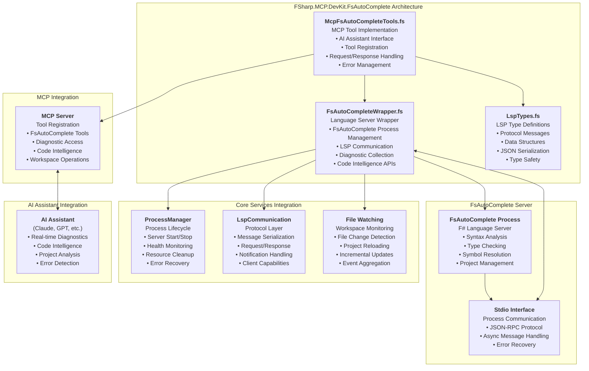

# FSharp.MCP.DevKit.FsAutoComplete

`FSharp.MCP.DevKit.FsAutoComplete` provides a comprehensive F# Language Server Protocol (LSP) integration for the FSharp.MCP.DevKit solution. This project wraps FsAutoComplete functionality to enable real-time code intelligence, diagnostics, and language services through MCP tools accessible to AI assistants.

## Overview

The FsAutoComplete project provides:

- FsAutoComplete language server wrapper
- LSP communication layer
- Real-time F# diagnostics
- Code intelligence services
- MCP tool interface for AI assistants
- Project and workspace management

## Architecture

The FsAutoComplete project implements a modern language server integration with:

- **FsAutoComplete Integration**: Direct wrapper around F# language server
- **LSP Protocol Support**: Full Language Server Protocol implementation
- **Real-time Diagnostics**: Live error detection and reporting
- **Code Intelligence**: Hover info, definitions, signatures
- **MCP Tool Interface**: AI assistant accessible through MCP protocol
- **Workspace Management**: Project loading and file watching
- **Process Management**: Robust server lifecycle handling

## Key Components

### FsAutoCompleteWrapper

The core wrapper class that manages the FsAutoComplete language server:

- **Process Management**: Starts, monitors, and stops FsAutoComplete server
- **LSP Communication**: Handles all Language Server Protocol messages
- **Diagnostic Collection**: Gathers and processes F# compiler diagnostics
- **Code Intelligence**: Provides hover information, definitions, and signatures
- **Workspace Management**: Loads projects and manages file watching

### McpFsAutoCompleteTools

MCP tool interface that exposes FsAutoComplete capabilities to AI assistants:

- **StartFsAutoComplete**: Initialize language server with workspace support
- **CheckFile**: Get real-time diagnostics for F# files
- **GetDocumentation**: Retrieve hover information and documentation
- **GetSignature**: Access type signatures and function information
- **LoadProject**: Load F# projects for comprehensive analysis
- **WorkspacePeek**: Discover F# projects and solutions in directories

### LspTypes Integration

Unified LSP type system for consistent protocol handling:

- **Type Safety**: Strongly-typed LSP message structures
- **JSON Serialization**: Automatic serialization/deserialization
- **Protocol Compliance**: Full LSP specification adherence
- **Error Handling**: Robust error types and recovery mechanisms

## MCP Tools

The FsAutoComplete project exposes the following MCP tools:

### Language Server Management

- `StartFsAutoComplete` - Initialize FsAutoComplete with workspace support
- `StartFsAutoCompleteWithWorkspace` - Start with full project loading and file watching
- `StopFsAutoComplete` - Gracefully shutdown language server
- `GetStatus` - Check language server status and health

### Code Intelligence

- `CheckFile` - Get real-time F# diagnostics and errors
- `GetDocumentation` - Retrieve hover information for symbols
- `GetSignature` - Access type signatures and function information
- `GetDiagnostics` - Structured diagnostic information retrieval

### Workspace Operations

- `LoadProject` - Load single F# project for analysis
- `WorkspaceLoad` - Load multiple projects or solutions
- `WorkspacePeek` - Discover F# projects in directory structure
- `GetWorkspaceStatus` - Current workspace and project loading status

## Integration Points

### Communication Layer

Integrates with `FSharp.MCP.DevKit.Communication` for:

- Named pipe communication
- Process management utilities
- Concurrent message handling
- Error recovery mechanisms

### Server Integration

Works with `FSharp.MCP.DevKit.Server` for:

- MCP tool registration
- Request routing and handling
- Error management and logging
- Client communication coordination

### Core Services

Leverages `FSharp.MCP.DevKit.Core` for:

- Shared utilities and types
- Configuration management
- Logging infrastructure
- Common error handling patterns

## Benefits for AI Assistants

### Real-time Code Intelligence

- **Live Diagnostics**: Immediate feedback on F# code quality
- **Type Information**: Rich type signatures and documentation
- **Error Detection**: Comprehensive compiler error reporting
- **Symbol Resolution**: Accurate go-to-definition and references

### Workspace Awareness

- **Project Context**: Understanding of project structure and dependencies
- **Multi-project Support**: Analysis across solution boundaries
- **Incremental Updates**: Efficient handling of code changes
- **Build Integration**: Integration with F# build process

### Developer Experience

- **IntelliSense-like Features**: Auto-completion and suggestions
- **Documentation Access**: Inline documentation and help text
- **Refactoring Support**: Safe code transformations
- **Performance Optimization**: Efficient language server communication

## Related Projects

- [Server](../Server/) - MCP server hosting and tool registration
- [Communication](../Communication/) - IPC and process management
- [Core](../Core/) - Shared utilities and infrastructure
- [Analysis](../Analysis/) - Additional code analysis capabilities
- [CodeEditing](../CodeEditing/) - Code manipulation and formatting
