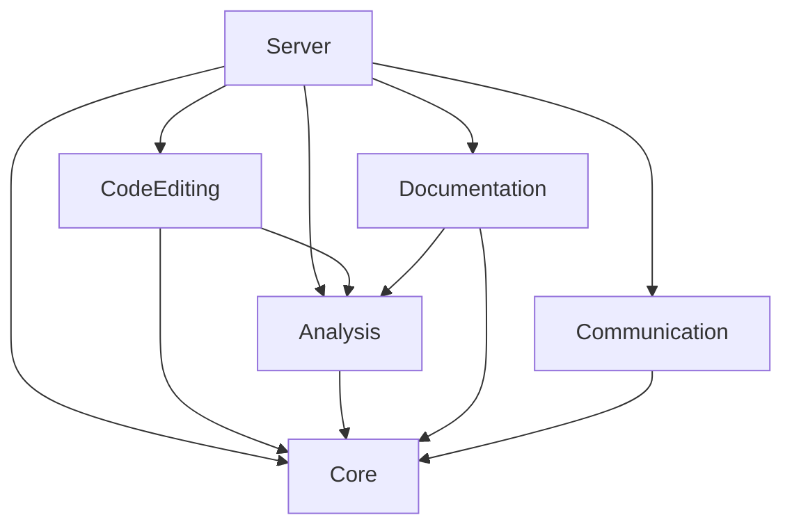

# FSharp.MCP.DevKit Projects Documentation

This folder contains organized documentation for each project within the FSharp.MCP.DevKit solution.

## Project Structure

The FSharp.MCP.DevKit solution consists of six main projects, each with dedicated documentation:

### 🔧 [Core](Core/)
**F# Interactive Core Services**
- F# Interactive session management
- Code execution and evaluation services
- Script loading and package references
- Expression evaluation with type information
- 📋 **[Roadmap](Core/ROADMAP.md)** - Session pooling, performance optimization, distributed operations

### 🌐 [Server](Server/)
**MCP Protocol Implementation**
- Model Context Protocol server
- Tool registration and execution
- Client communication handling
- Server lifecycle management
- 📋 **[Roadmap](Server/ROADMAP.md)** - Enhanced tool experience, workspace management, AI integration

### 📡 [Communication](Communication/)
**Inter-Process Communication**
- Named pipe communication for FSI
- High-performance IPC protocols
- File system operations and monitoring
- Concurrent communication handling
- 📋 **[Roadmap](Communication/ROADMAP.md)** - Multi-protocol support, security, enterprise features

### ✏️ [CodeEditing](CodeEditing/)
**Safe Code Manipulation**
- Safe F# code insertion with AST validation
- Code formatting integration with Fantomas
- Structure analysis and dependency tracking
- Preview capabilities for code changes
- 📋 **[Roadmap](CodeEditing/ROADMAP.md)** - AST-based refactoring, intelligent transformations

### 🔍 [Analysis](Analysis/)
**Code Analysis & Symbol Detection**
- F# code structure analysis
- Symbol detection and resolution
- Type information extraction
- Dependency and scope analysis
- 📋 **[Roadmap](Analysis/ROADMAP.md)** - Advanced F# features, code quality metrics, AI-assisted analysis

### 📚 [Documentation](Documentation/)
**API Documentation Generation**
- Reflection-based .NET assembly analysis
- XML documentation integration
- NuGet package documentation generation
- Rich markdown API reference output
- 📋 **[Roadmap](Documentation/ROADMAP.md)** - Cross-references, multiple output formats, AI-powered docs

## Cross-Project Dependencies

## Getting Started

Each project folder contains:
- **README.md** - Project overview and navigation
- **ROADMAP.md** - Development roadmap and future plans
- **Project-specific documentation** - Detailed implementation docs
- **API references** - Technical specifications and examples

## Development Roadmaps

Each project has a detailed roadmap outlining planned enhancements and future development:

### 🗺️ Roadmap Overview

| Project | Current Focus | Next Major Feature | Long-term Vision |
|---------|---------------|-------------------|------------------|
| 🔧 **Core** | Performance optimization | Session pooling | Distributed operations |
| 🌐 **Server** | Tool experience | Workspace management | AI assistant integration |
| 📡 **Communication** | Reliability | Multi-protocol support | Enterprise security |
| ✏️ **CodeEditing** | Advanced editing | AST-based refactoring | Collaborative editing |
| 🔍 **Analysis** | F# feature support | Code quality metrics | AI-assisted analysis |
| 📚 **Documentation** | Cross-references | Multiple output formats | AI-powered docs |

### 📅 Timeline Overview

- **Q2 2025:** Performance optimizations, cross-references, enhanced tool experience
- **Q3 2025:** Advanced F# support, intelligent transformations, workspace management  
- **Q4 2025:** Enterprise features, multi-format docs, AI integration
- **2026+:** Collaborative features, cloud deployment, AI-powered development

## Implementation Status

| Project | Status | Documentation Quality |
|---------|--------|--------------------|
| Core | ✅ Complete | 📖 Comprehensive |
| Server | ✅ Complete | 📖 Comprehensive |
| Communication | ✅ Complete | 📖 Comprehensive |
| CodeEditing | ✅ Complete | 📖 Comprehensive |
| Analysis | ✅ Complete | 📖 Comprehensive |
| Documentation | 🔄 In Progress (65%) | 📖 Comprehensive |

## Quick Navigation

- **[Overall Project README](../../Scripting/Documentation/README.md)** - Main project documentation
- **[Implementation Plans](plans/)** - Development roadmaps and specifications
- **[Design Documents](../DESIGN_AND_ANALYSIS.md)** - Architecture and design decisions
