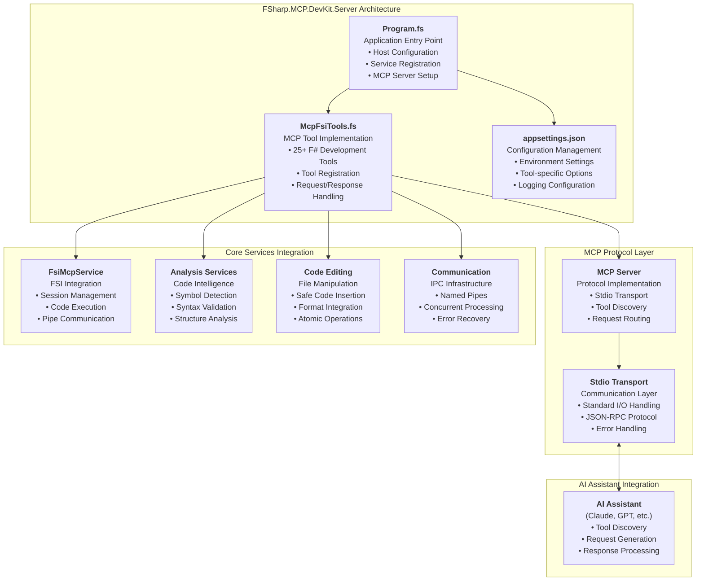

# FSharp.MCP.DevKit.Server

`FSharp.MCP.DevKit.Server` is the application host and primary entry point for the FSharp.MCP.DevKit solution. This project implements a comprehensive Model Context Protocol (MCP) server that exposes 25+ specialized tools for F# Interactive session management, code analysis, documentation generation, and advanced scripting capabilities.

## Overview

The Server project provides:
- MCP protocol implementation
- Server lifecycle management
- Tool registration and execution
- Client communication handling
- Error handling and logging

## Architecture

The Server project implements a modern .NET hosting architecture with:
- **MCP Protocol Compliance**: Full implementation of Model Context Protocol specification
- **Tool-Based Architecture**: Extensive collection of specialized F# scripting tools
- **Dependency Injection**: Enterprise-grade service container configuration
- **Stdio Transport**: Standard input/output communication for MCP clients
- **Comprehensive Logging**: Structured logging with configurable levels
- **Graceful Shutdown**: Proper resource cleanup and session management

## Related Projects

- [Core](../Core/) - F# Interactive core services
- [Communication](../Communication/) - IPC and communication protocols
- [CodeEditing](../CodeEditing/) - Code manipulation tools
- [Analysis](../Analysis/) - Code analysis capabilities
- [Documentation](../Documentation/) - Documentation generation
